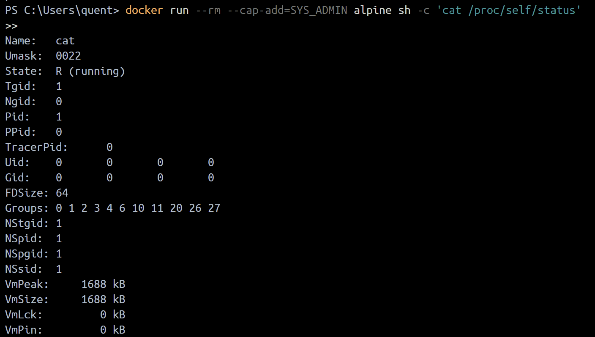
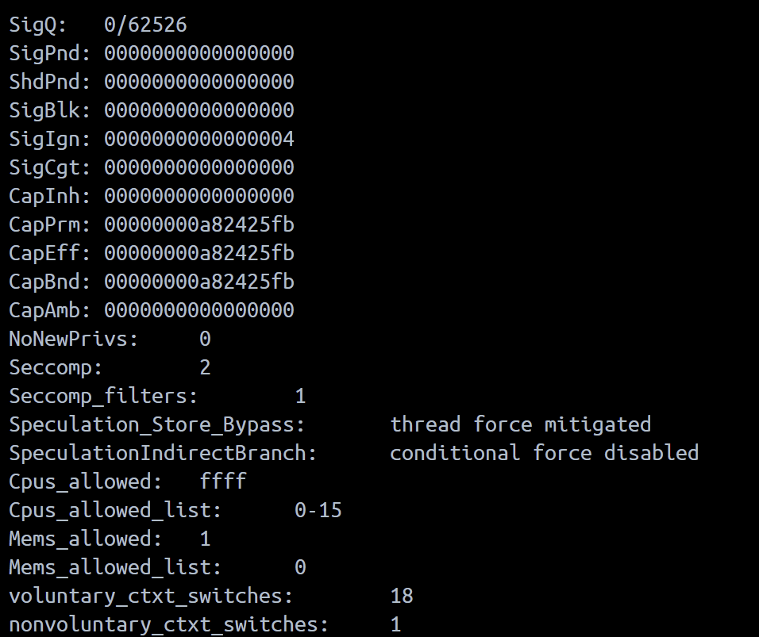
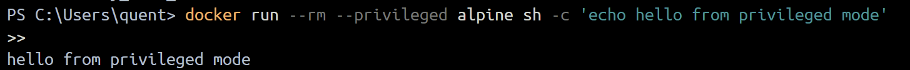
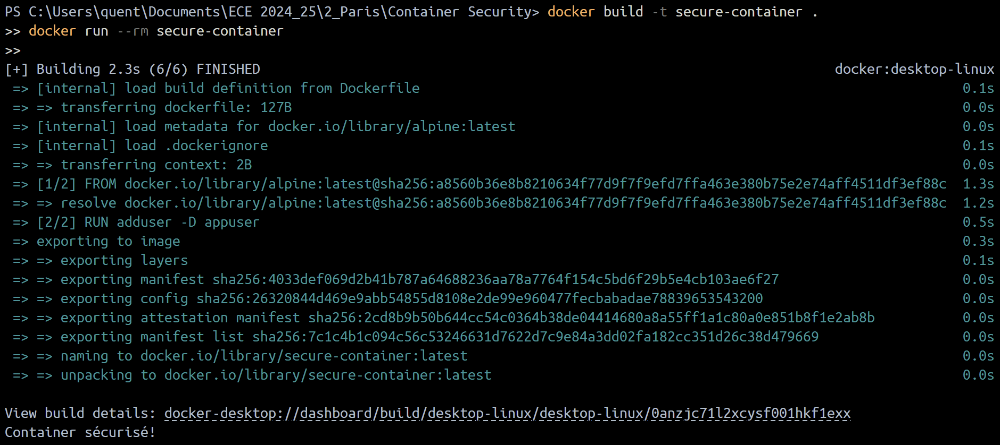
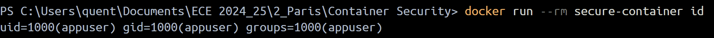
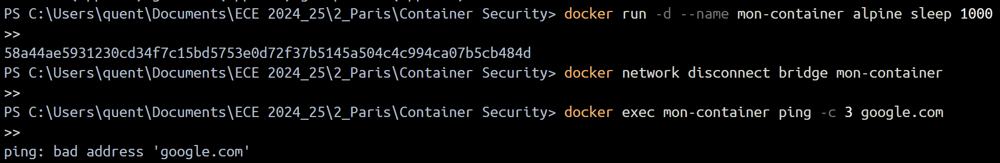

# Session 1: Container Security - Activités Pratiques

## Objectif
Cette session a pour but de vous familiariser avec les bases des containers Docker, leur fonctionnement, et les ressources qu'ils consomment.

---

## Activités Pratiques

### 1. Lancer un Container Simple
1. **Installer Docker**  
    Si Docker n'est pas encore installé, suivez le [guide officiel d'installation](https://docs.docker.com/get-docker/).

2. **Exécuter un container de test**  
    ```bash
    docker run --rm hello-world
    ```
    - Observez les logs affichés.
    - Comprenez les étapes du lancement du container.  
      Lorsque vous exécutez la commande `docker run --rm hello-world`, Docker télécharge l'image `hello-world` si elle n'est pas déjà présente localement, puis crée et exécute un container basé sur cette image. Une fois le container terminé, il est automatiquement supprimé grâce à l'option `--rm`.

      
    *Illustration de l'exécution réussie du container `hello-world` et des logs affichés.*

---

### 2. Explorer un Container en Interactif
1. **Lancer un container interactif basé sur Alpine**  
    ```bash
    docker run -it --rm alpine sh
    ```
2. **Tester des commandes Linux dans le container**  
    - `ls`  
        - Cette commande liste les fichiers et dossiers présents dans le répertoire actuel.

    - `pwd`  
        - Cette commande affiche le chemin absolu du répertoire courant.

    - `whoami`  
        - Cette commande indique l'utilisateur actuellement connecté dans le container.

          
        *Illustration de l'exécution des commandes de base dans un container Alpine.*

          
        *Exemple de test de connectivité réseau en utilisant la commande `ping` pour vérifier l'accès à Google.*

---

### 3. Analyser les Ressources Système d’un Container
1. **Lancer un container et surveiller ses ressources**  
    ```bash
    docker run -d --name test-container nginx
    docker stats test-container
    ```
2. **Observer la consommation de CPU et mémoire**.

      
    *Illustration de la consommation des ressources système (CPU et mémoire) d’un container en cours d’exécution.*

---

### 4. Lister les Capacités d’un Container
1. **Vérifier les permissions**  
    ```bash
    docker run --rm --cap-add=SYS_ADMIN alpine sh -c 'cat /proc/self/status'
    ```
    
    

    *Illustration des permissions et capacités d’un container exécuté avec l’option `--cap-add=SYS_ADMIN`.*  
    *La première image montre les permissions par défaut, tandis que la seconde illustre les permissions étendues obtenues grâce à cette option.*  
    *Le fichier `/proc/self/status` contient des informations détaillées sur le processus en cours d'exécution.*  
    *L’option `--cap-add=SYS_ADMIN` accorde au container des privilèges supplémentaires, permettant d'effectuer des actions normalement restreintes.*

---

### 5. Tester un Container avec des Permissions Élevées
1. **Lancer un container en mode privilégié**  
    ```bash
    docker run --rm --privileged alpine sh -c 'echo hello from privileged mode'
    ```
    - Observez pourquoi cette pratique peut être dangereuse. Un container en mode privilégié a un accès étendu au système hôte, ce qui peut compromettre la sécurité.

    

    *Illustration de l'exécution d'un container en mode privilégié. Ce mode accorde au container des permissions étendues, ce qui peut permettre des interactions directes avec le matériel ou des modifications critiques sur l'hôte. Cette configuration doit être évitée sauf en cas de nécessité absolue.*

2. **Simuler une évasion de container**  
    ```bash
    docker run --rm -v /:/mnt alpine sh -c 'ls /mnt'
    ```
    - Analysez les implications de cette faille de configuration. Monter le système de fichiers de l’hôte dans un container peut permettre à un attaquant d’accéder ou de modifier des fichiers critiques.

    

    *Illustration de l'accès au système de fichiers de l'hôte depuis un container. Cette pratique doit être évitée pour garantir la sécurité de l'environnement hôte.*

---

### 6. Créer une Image Sécurisée
1. **Écrire un Dockerfile minimaliste**  
    ```dockerfile
    # Utilisation de l'image de base Alpine, légère et sécurisée
    FROM alpine

    # Ajout d'un utilisateur non-root pour limiter les privilèges
    RUN adduser -D appuser

    # Passage à l'utilisateur non-root
    USER appuser

    # Commande par défaut exécutée par le container
    CMD ["echo", "Container sécurisé!"]
    ```
2. **Construire et exécuter l’image**  
    ```bash
    docker build -t secure-container .
    docker run --rm secure-container
    ```

    
    *Illustration de la construction et de l'exécution d'une image sécurisée. Cette image utilise un utilisateur non-root pour renforcer la sécurité et limiter les privilèges dans le container.*

3. **Afficher l'id et l'uid de l'utilisateur**  
        ```bash
        docker run --rm secure-container id
        ```
          
        *Illustration de l'exécution de la commande `id` dans un container sécurisé. Cette commande affiche l'identifiant utilisateur (UID) et les groupes associés, confirmant que le container s'exécute avec un utilisateur non-root, renforçant ainsi la sécurité.*


---

### 7. Restreindre l’Accès Réseau d’un Container

1. **Bloquer la connexion internet dans un container**  
    ```bash
    docker network disconnect bridge mon-container
    ```

2. **Tester l’accès internet**  
    ```bash
    docker exec mon-container ping google.com
    ```
    - Vérifiez que le container ne peut plus accéder à Internet.

      
    *Illustration montrant qu'un container ne peut plus accéder à Internet après avoir été déconnecté du réseau `bridge`. Cette pratique peut être utilisée pour limiter les communications réseau d'un container et renforcer la sécurité.*

---

### 8. Télécharger et Scanner une Image
1. **Télécharger une image vulnérable et l’analyser avec Trivy**  
    ```bash
    docker pull vulnerables/web-dvwa
    trivy image vulnerables/web-dvwa
    ```
2. **Sauvegarder le résultat en JSON**  
    ```bash
    trivy image --format json --output scan-result.json vulnerables/web-dvwa
    ```
3. **Résumé des vulnérabilités**  
    - Faites un rapide résumé des vulnérabilités détectées dans l’image.

---

### 9. Scanner une Image pour Détecter les Vulnérabilités
1. **Analyser une image avec Grype**  
    ```bash
    grype alpine:latest
    ```
2. **Comparer votre image construite avec l'image `alpine:latest`**  
    - Identifiez les différences entre les vulnérabilités détectées dans votre image et celles de l’image `alpine:latest`.

3. **Comparer Grype et Trivy**  
    - Discutez des différences entre les deux outils en termes de détection et de présentation des résultats.

--- 
