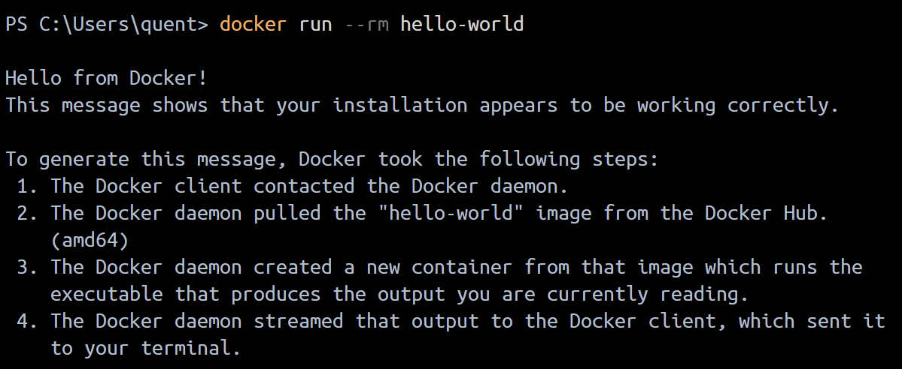
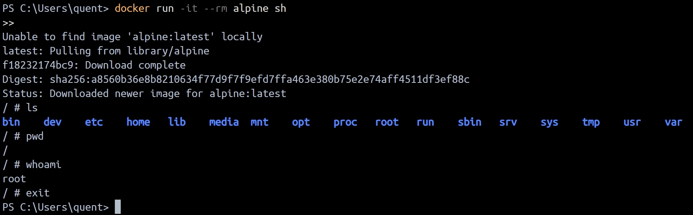
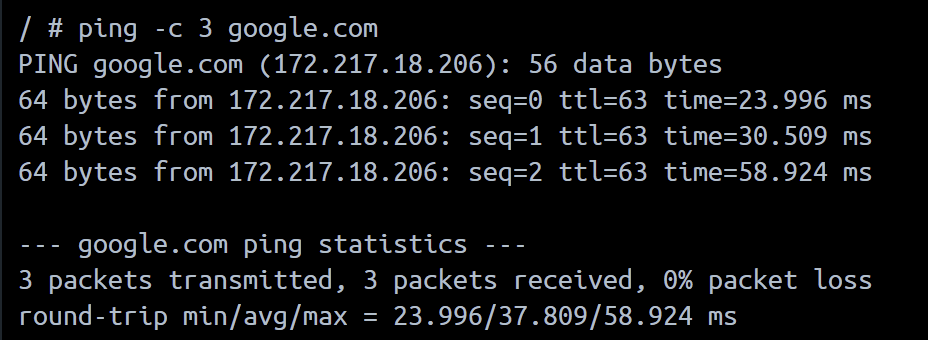
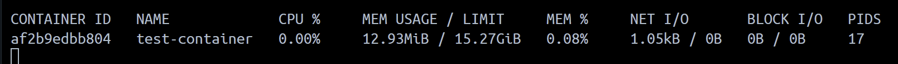

# Session 1: Container Security - Activités Pratiques

## Objectif
Cette session a pour but de vous familiariser avec les bases des containers Docker, leur fonctionnement, et les ressources qu'ils consomment.

---

## Activités Pratiques

### 1. Lancer un Container Simple
1. **Installer Docker**  
    Si Docker n'est pas encore installé, suivez le [guide officiel d'installation](https://docs.docker.com/get-docker/).

2. **Exécuter un container de test**  
    ```bash
    docker run --rm hello-world
    ```
    - Observez les logs affichés.
    - Comprenez les étapes du lancement du container.

    

---

### 2. Explorer un Container en Interactif
1. **Lancer un container interactif basé sur Alpine**  
    ```bash
    docker run -it --rm alpine sh
    ```
2. **Tester des commandes Linux dans le container**  
    - `ls`
    - `pwd`
    - `whoami`

    

    

---

### 3. Analyser les Ressources Système d’un Container
1. **Lancer un container et surveiller ses ressources**  
    ```bash
    docker run -d --name test-container nginx
    docker stats test-container
    ```
2. **Observer la consommation de CPU et mémoire**.



---

### 4. Lister les Capacités d’un Container
1. **Vérifier les permissions**  
    ```bash
    docker run --rm --cap-add=SYS_ADMIN alpine sh -c 'cat /proc/self/status'
    ```

---

## Notes
- Assurez-vous d'avoir les droits administratifs pour exécuter certaines commandes.
- Consultez la documentation Docker pour plus de détails : [Docker Documentation](https://docs.docker.com/).
