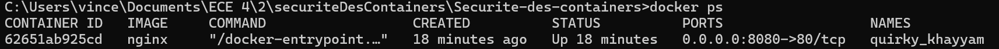

# Session 2: Bonnes Pratiques de Sécurité

## Objectif
Appliquer les meilleures pratiques pour sécuriser les containers.
Comprendre les principes de gestion des droits et permissions.

---

## Activités Pratiques

### 1. Éviter l’Exposition Involontaire de Ports

1. **Lancer un container avec restriction de ports** 

```bash
docker run -d -p 8080:80 nginx
```
Docker a bien démarré un conteneur Nginx en mode détaché (-d), et a associé le port 8080 de ton hôte au port 80 du conteneur. 

 

La longue suite de caractères que l'on peut apercevoir correspond à l’ID du conteneur qui vient d’être créé.

```bash
docker ps
```
On vérifie que le container tourne bien grâce à la commande Docker ps.


On aperçoit que le container tourne.
-Il utilise l’image nginx.
-Il est démarré depuis 18 minutes
-Le port 8080 de l’hôte est mappé vers le port 80 du conteneur, ce qui signifie que tu peux y accéder via :

```bash
http://localhost:8080
```

-Nom aléatoire (quirky_khayyam) attribué par Docker (car aucun nom explicite n’a été défini lors de la création).

2. **Vérifier si le port est bien exposé**

```bash
netstat -ano | findstr :8080
```
On vérifie si le port est exposé avec netstat



-Le port 8080 est bien en écoute (LISTENING) sur toutes les interfaces (0.0.0.0)

-Cela signifie que ton conteneur accepte des connexions depuis n’importe quelle adresse IP sur ta machine.
-Si on ouvre un navigateur et que l'on tape  http://localhost:8080, on devrait voir la page par défaut de Nginx.

3. **Vérifier si le conteneur répond bien (Bonus)**


Cela marche bien. On voit la page Nginx par défault.

### 2. Restreindre les permissions d’accès aux fichiers sensibles

1. **Monter un volume avec des permissions spécifiques** 

```bash
docker run -it --rm -v /etc/passwd:/mnt/passwd:ro alpine sh
```
-v /etc/passwd:/mnt/passwd:ro : Monte le fichier /etc/passwd en mode lecture seule (ro).
-Permet de tester si le fichier est accessible et modifiable.

Pouvez vous lire le fichier /mnt/passwd ?


On peut apercevoir que le fichier est lisible.

Pouvez-vous écrire le fichier /mnt/passwd ?


On peut apercevoir que nous n'avons pas les droits pour écrire. Nous sommes juste en mode Read-only.

### 3. Auditer la configuration d’un container avec Docker Bench

1. **Installer et exécuter Docker Bench for Security** 

```bash
git clone https://github.com/docker/docker-bench-security.git
cd docker-bench-security/
```

Auditer votre host, quelle est votre score ?


Comme je suis sur Windows, j'ai du taper la commande suivante pour auditer.

```bash
docker run -it --rm --cap-add audit_control -v //var/run/docker.sock:/var/run/docker.sock docker/docker-bench-security
```

On obtient un score de 9.

Auditer le container vulnerables/web-dvwa, que remarquez-vous ?

On démarre le conteneur web-dvwa avec la commande suivante :

```bash
docker run -d --name dvwa vulnerables/web-dvwa
```

A