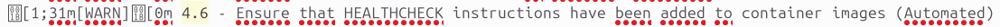

# Session 2: Bonnes Pratiques de Sécurité

## Objectif
Appliquer les meilleures pratiques pour sécuriser les containers.
Comprendre les principes de gestion des droits et permissions.

---

## Activités Pratiques

### 1. Éviter l’Exposition Involontaire de Ports

1. **Lancer un container avec restriction de ports** 

```bash
docker run -d -p 8080:80 nginx
```
Docker a bien démarré un conteneur Nginx en mode détaché (-d), et a associé le port 8080 de ton hôte au port 80 du conteneur. 

 

La longue suite de caractères que l'on peut apercevoir correspond à l’ID du conteneur qui vient d’être créé.

```bash
docker ps
```
On vérifie que le container tourne bien grâce à la commande Docker ps.


On aperçoit que le container tourne.
-Il utilise l’image nginx.
-Il est démarré depuis 18 minutes
-Le port 8080 de l’hôte est mappé vers le port 80 du conteneur, ce qui signifie que tu peux y accéder via :

```bash
http://localhost:8080
```

-Nom aléatoire (quirky_khayyam) attribué par Docker (car aucun nom explicite n’a été défini lors de la création).

2. **Vérifier si le port est bien exposé**

```bash
ss -tuln
```
On vérifie si le port est exposé avec ss


```bash
netstat -tuln
```
On vérifie si le port est exposé avec netstat


On tape la commande suivante pour relancer le container avec une IP d’écoute restreinte :

```bash
docker run -d -p 127.0.0.1:8080:80 nginx
```


Le terminal  retourne l’ID du container, ce qui signifie que :

-Le port 8080 est bien en écoute (LISTENING) sur toutes les interfaces (0.0.0.0)

-Cela signifie que ton conteneur accepte des connexions depuis n’importe quelle adresse IP sur ta machine.
-Si on ouvre un navigateur et que l'on tape  http://localhost:8080, on devrait voir la page par défaut de Nginx.

3. **Vérifier si le conteneur répond bien (Bonus)**


Cela marche bien. On voit la page Nginx par défault.

### 2. Restreindre les permissions d’accès aux fichiers sensibles

1. **Monter un volume avec des permissions spécifiques** 

```bash
docker run -it --rm -v /etc/passwd:/mnt/passwd:ro alpine sh
```
-v /etc/passwd:/mnt/passwd:ro : Monte le fichier /etc/passwd en mode lecture seule (ro).
-Permet de tester si le fichier est accessible et modifiable.

Pouvez vous lire le fichier /mnt/passwd ?


On peut apercevoir que le fichier est lisible.

Pouvez-vous écrire le fichier /mnt/passwd ?


On peut apercevoir que nous n'avons pas les droits pour écrire. Nous sommes juste en mode Read-only.

### 3. Auditer la configuration d’un container avec Docker Bench

1. **Installer et exécuter Docker Bench for Security** 

```bash
git clone https://github.com/docker/docker-bench-security.git
cd docker-bench-security/
```

Auditer votre host, quelle est votre score ?


Comme je suis sur Windows, j'ai du taper la commande suivante pour auditer.

```bash
docker run -it --rm --cap-add audit_control -v //var/run/docker.sock:/var/run/docker.sock docker/docker-bench-security
```


On obtient un score de 9.


J'ai refait la même procédure sur ubuntu.

```bash
sudo ./docker-bench-security.sh
```


On obtient un score de 0,  ce qui ne correspond pas à une note, juste une valeur par défaut.

Néanmoins, tous les tests sont [PASS], mais ils indiquent :

(Swarm mode not enabled)

Cela signifie que notre hôte n'utilise pas Docker Swarm, donc ces tests ne sont pas réellement exécutés, mais considérés comme non concernés


On démarre le container vulnérable (DVWA) :

```bash
docker run -d --name dvwa vulnerables/web-dvwa
```


Auditer le container vulnerables/web-dvwa, que remarquez-vous ?


On lance l'audit via la commande suivante :

```bash
sudo ./docker-bench-security.sh > audit_dvwa.txt
```


L’audit Docker Bench révèle plusieurs faiblesses importantes liées au container dvwa, ce qui confirme qu’il est conçu pour être vulnérable. Voici les principales observations accompagnées de captures d’écran.
Puis on audit le container DVWA :


Sur cette capture du fichier dvwa.txt, on peut comprendre que container dvwa utilise l’utilisateur root, ce qui représente un risque important : en cas de compromission, un attaquant aurait un accès complet.


Sur cette capture du fichier dvwa.txt, on peut comprendre qu'aucune sécurité type SELinux, AppArmor ou seccomp n’est configurée, laissant le container sans isolation avancée.


Sur cette capture du fichier dvwa.txt, on peut comprendre que le système de fichiers du container est monté en lecture/écriture, ce qui permettrait à un attaquant de modifier potentiellement le contenu du container.



Sur cette capture du fichier dvwa.txt, on peut comprendre que l’absence de HEALTHCHECK rend difficile la détection automatique d’un service en panne.


Enfin, sur cette capture du fichier dvwa.txt, on peut comprendre qu'aucune restriction sur l’élévation de privilèges (no-new-privileges=false), donc un binaire setuid peut par exemple élever ses droits à l'intérieur du container.


### 4. Stocker et Utiliser des Secrets

1. **Lancer un container Vault** 

On lance le container Vault via la commande suivante :

```bash
docker run --cap-add=IPC_LOCK \
  -e 'VAULT_LOCAL_CONFIG={"storage": {"file": {"path": "/vault/file"}}, "listener": [{"tcp": { "address": "0.0.0.0:8200", "tls_disable": true}}], "default_lease_ttl": "168h", "max_lease_ttl": "720h", "ui": true}' \
  -p 8200:8200 vault:1.13.3 server
```


1. **Accéder à l’interface UI** 


On tape http://localhost:8200 sur un interpréteur web, puis on arrive sur cette page Vault :


On obtient une clé de déchiffrement (Unseal Key) et un Root Token (c’est celui ci que l'on va utiliser pour nous connecter).
On sauvegarde ces clés dans un fichier vault-init.txt temporaire.


Une fois arrivé sur cette page, on doit entrer la key1 que l'on a enregistré au préalable dans notre fichier vault-init.txt.


Puis on arrive sur cette page où l'on entre le token également enregistré au préalable dans notre fichier vault-init.txt.


On arrive bien à notre "page d'admnistration" Vault.


2. **Ajout d'un moteur kv** 

On ajoute un moteur kv :


Dans le champs path, on met "containers"


3. **Ajout d'un moteur secret** 

Puis on ajoute un secret 


On entre des valeurs pour le secret 


4. **Ajout d'une policies** 

On ajoute une policies 


On accorde le droit de lecture 


5. **Création/association de password à la policy** 


On créé le user 1 :


On ajoute la policy à l'user :


5. **Lancer un container alpine et avec l'outil curl faire une authentification au Vault, puis récuperer le secret** 


On lance le container alpine avec la commande suivante :

```bash
docker run -it alpine sh
```

On installe curl ç l'intérieur du container Alpine

```bash
apk add curl
```


On a authentifier l'user1 via Vault :


Voici le client_token :

hvs.CAESIAEmmFBmGErCjDx2M2ZAhv-SNKgUM2PUgJcnafW9BgIWGh4KHGh2cy5HQWo4Q1k0VXJETk5vM05KcFJhcGtmdDk


Maintenant, on va lire le secret via la commande :

```bash
curl --header "X-Vault-Token: hvs.CAESIAEmmFBmGErCjDx2M2ZAhv-SNKgUM2PUgJcnafW9BgIWGh4KHGh2cy5HQWo4Q1k0VXJETk5vM05KcFJhcGtmdDk" \
  http://10.0.2.15:8200/v1/containers/data/mon-secret
```

On a bien récupéré le secret "mon-secret" stocké dans Vault depuis un container Alpine via l'API REST


### 5. Trouver une clé API dans une image Docker

docker pull ety92/demo:v1

Pour cela on utilise la commande CLI :

```bash
docker pull ety92/demo:v1
```

5. **Lancer un container alpine et avec l'outil curl faire une authentification au Vault, puis récuperer le secret**

1. **Créer un container à partir de l’image**

```bash
docker run -it --rm ety92/demo:v1 sh
```

2. **Exporter le système de fichiers du container dans une archive**

```bash
docker export demo_temp > demo.tar
```

3. **Créer un dossier pour extraire le contenu**

```bash
docker export demo_temp > demo.tar
```

4. **Extraire l’archive dans ce dossier**

```bash
tar -xf demo.tar -C demo_contents
```

5. **Rechercher une clé ou un secret dans tous les fichiers**

```bash
grep -ri "api_key\|key\|secret" demo_contents
```


On peut apercevoir la clé :


 

Comment le développeur aurait dû éviter ça ?

Le développeur aurait dû ne jamais intégrer la clé API directement dans l'image Docker.

1. Utiliser des variables d’environnement au runtime 
2. Monter un fichier secret à l’exécution 
3. Utiliser un outil de gestion des secrets sécurisé, comme :
-Vault
-AWS Secrets Manager
-Docker Swarm secrets
-Kubernetes secrets


### 6. Rootless mode

On lance sur le port 8080 car les ports inférieurs à 1024 (comme le port 80) nécessitent des privilèges root, donc en mode rootless, on aura (j'ai testé) une erreur du type :
Error starting userland proxy: listen tcp4 0.0.0.0:80: bind: permission denied


Et voila le résultat :


On se retrouve bien sur la page d'accueil de Nginx
